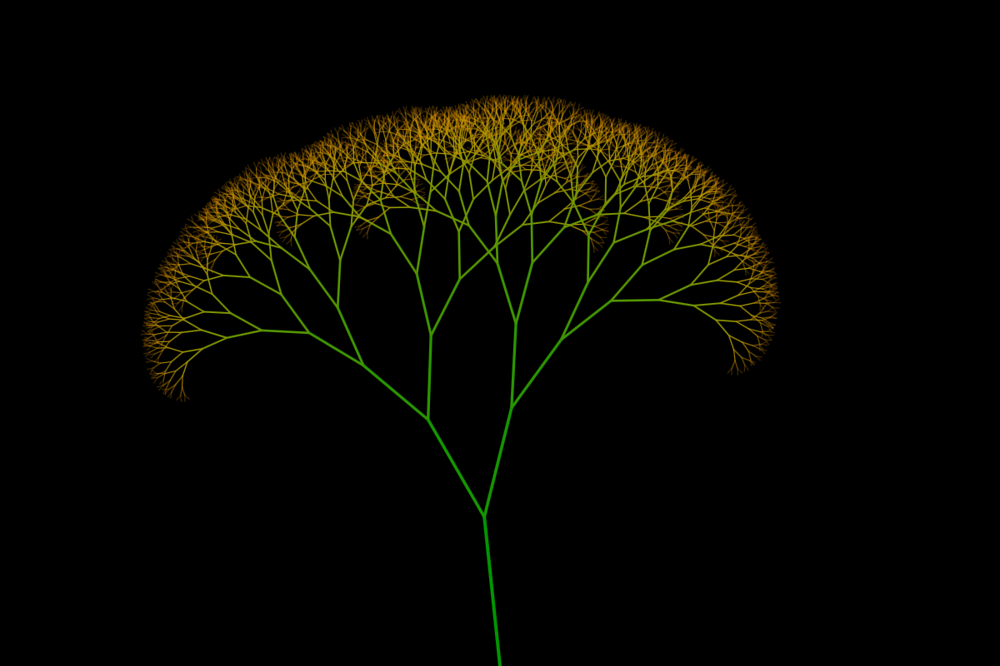

# fractal-tree

Desenha uma árvore simples baseada em fractais. 

Cada ramo da árvore se divide em dois.
Os ramos criados tem um tamanho 25% menor que seu ramo original.

Seu angulo muda aleatoriamente entre 10 a 20 graus, para direita e esquerda.

A cor é calculada com base na altura.

